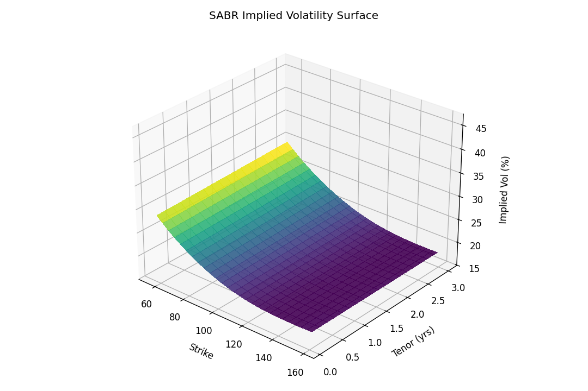
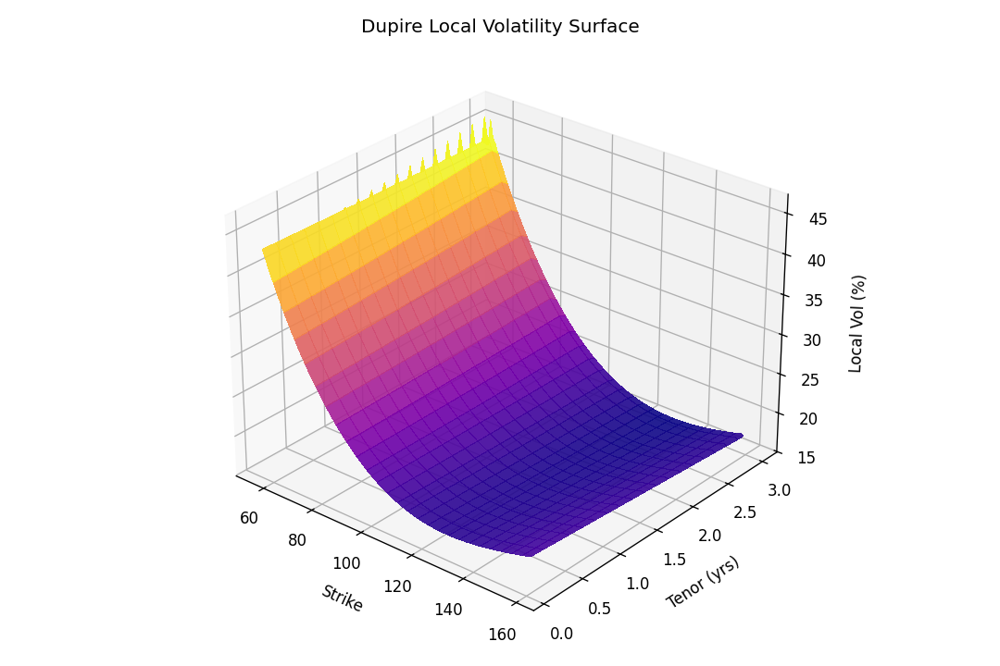
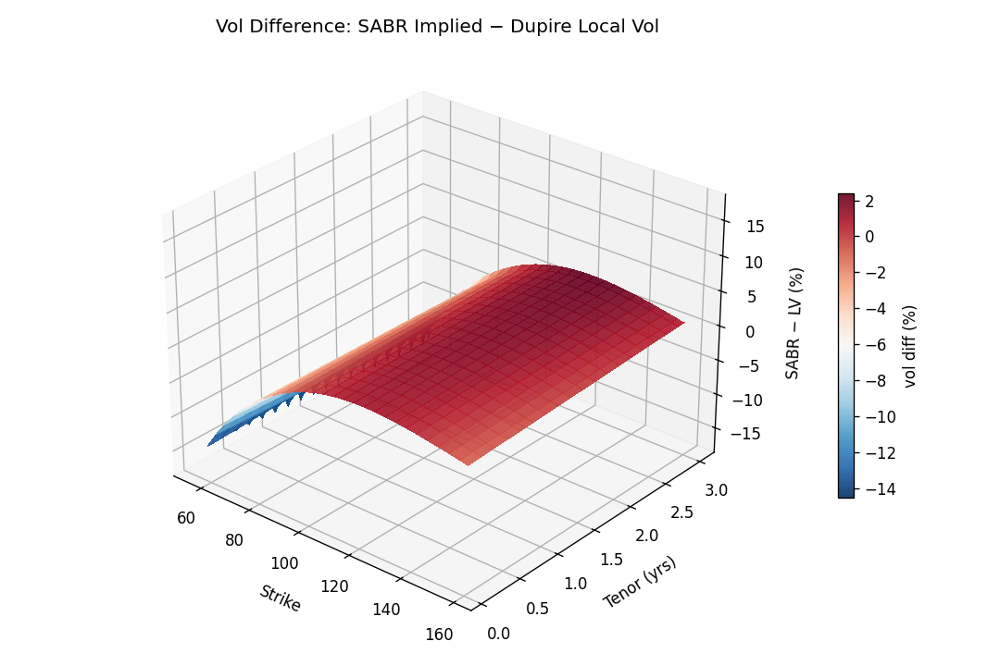
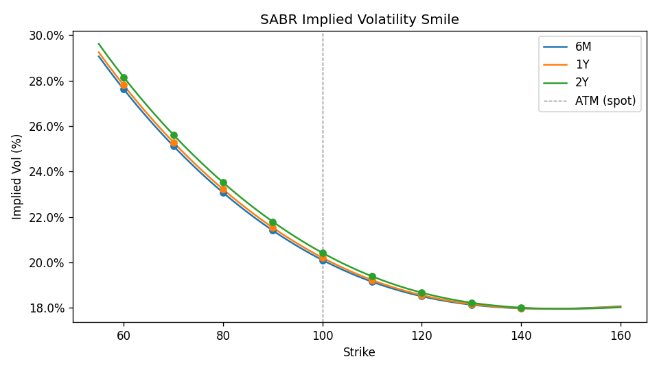
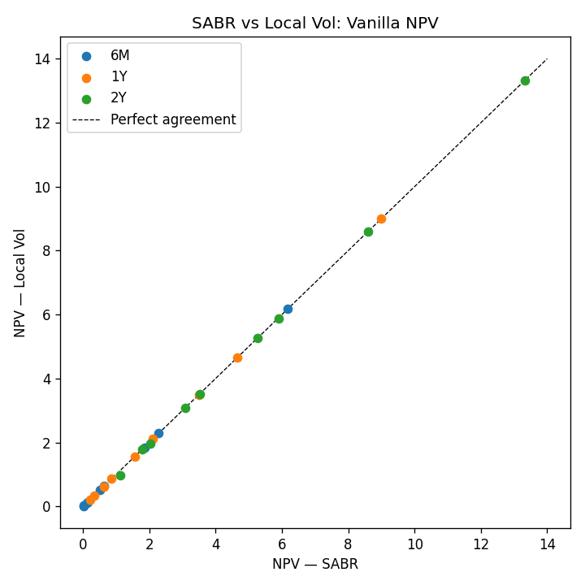
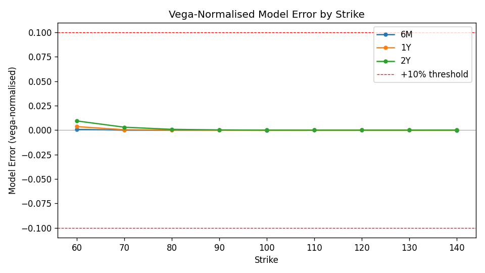
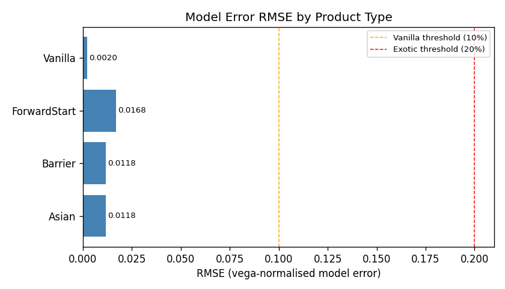

# Validation Report — sabr_localvol_consistency

**Date:** 2026-03-15  
**Underlying:** SP5  
**Valuation Date:** 2026-03-15  

## Executive Summary

| Item | Value |
|------|-------|
| Overall Status | **PASSED ✓** |
| Total Trades | 32 |
| Failed Trades | 0 |
| Stability Score | 0.022124 |
| Path-Dep Bias | -0.013448 |

---

### How the Volatility Surfaces Are Constructed

This experiment validates consistency between a **SABR implied-vol surface** and a
**Dupire local-vol surface** derived from it. The two surfaces are built in sequence
through the pipeline stages described below.

#### Step 1 — SABR Calibration (Stage 3)

The SABR model (Hagan et al. 2002) parameterises the implied vol smile at each
maturity slice with four parameters: `alpha` (vol level), `beta` (CEV elasticity),
`rho` (spot/vol correlation), and `nu` (vol-of-vol). For this experiment the
parameters are set directly from config (synthetic market — no real quotes to fit):

| Parameter | Value | Role |
|-----------|-------|------|
| alpha | 2.0 | Sets the overall ATM vol level |
| beta | 0.5 | Controls the backbone (0=normal, 1=log-normal) |
| rho | -0.3 | Drives the skew slope (negative = equity skew) |
| nu | 0.4 | Controls smile curvature via stochastic vol |

The Hagan formula is evaluated on a dense grid of **106 strikes ×
36 tenors**, producing a matrix of Black implied vols. This matrix is
the *SABR surface* — it represents what the SABR stochastic vol model predicts
for option prices across all strikes and maturities.

#### Step 2 — Dupire Local Vol Construction (Stage 5)

The implied vol matrix is loaded into QuantLib's `BlackVarianceSurface`, which
stores total variance $V(K,T) = \sigma_{\text{impl}}^2(K,T) \cdot T$ and
interpolates bicubically across the grid. A `NoExceptLocalVolSurface` wrapper then
applies **Dupire's formula** to extract the local vol function:

$$\sigma_{LV}^2(K,T) = \frac{\partial V / \partial T}{\left(1 - \frac{K \partial \ln V}{2 \partial \ln K}\right)^2 + \frac{1}{4}\left(\frac{1}{4} + \frac{1}{V}\right)\left(\frac{\partial V}{\partial \ln K}\right)^2 - \frac{1}{2}\frac{\partial^2 V}{\partial (\ln K)^2}}$$

This is the *unique* local vol surface that is consistent with the input implied
vol surface under a diffusion process — i.e., it will reprice all vanilla options
identically to the SABR model (up to numerical error). The LV surface is persisted
to `surfaces/localvol/` and its smoothing is controlled by
`localvol.smoothing = 0.0001`.

#### Step 3 — Pricing Both Models (Stage 7)

The same portfolio of 32 trades is priced twice
using ORE Python bindings, under identical market inputs (spot, rate, div yield)
but different vol processes:

| | SABR Pass | Local Vol Pass |
|--|-----------|---------------|
| **Vanilla options** | Analytic Black (per-strike flat vol from SABR formula) | FD engine on Dupire GBM process (200×200 grid) |
| **Path-dependent** | MC — `MCEuropeanEngine` with flat ATM vol | MC — `MCEuropeanEngine` with Dupire GBM process |
| **MC paths** | 65,536 | 65,536 |
| **Random seed** | 42 | 42 |

Using the same seed and path count for both MC passes isolates *model error* from
*Monte Carlo noise*.

#### Step 4 — Comparison Metric (Stage 8)

Prices are merged and the **vega-normalised model error** is computed per trade:

$$\varepsilon = \frac{\text{NPV}_{\text{SABR}} - \text{NPV}_{\text{LV}}}{|\text{Vega}_{\text{SABR}}|}$$

Normalising by vega converts an absolute price difference into units of implied vol
(roughly: how many vol points would you need to move to explain the discrepancy).
This makes errors comparable across strikes and maturities with very different
price magnitudes. For near-zero vega (deep OTM), the metric falls back to
relative NPV difference.

The **Stability Score** (0.022124) measures the
standard deviation of model errors across all vanilla trades — a lower value means
the two surfaces are more uniformly consistent. The **Path-Dep Bias**
(-0.013448) is the mean model error across
path-dependent trades, capturing the systematic direction in which the two models
diverge for non-vanilla payoffs.

---

### Surface Visualisations

The three plots below give an immediate visual intuition for the construction and
comparison described above.

#### SABR Implied Volatility Surface

The SABR surface is evaluated on a dense 106-strike × 36-tenor
grid by interpolating the calibrated parameters linearly between the three
calibrated maturity slices (6M, 1Y, 2Y) and extrapolating flat beyond the furthest
maturity. The characteristic **skew ridge** running diagonally from low-strike /
short-tenor to high-strike / long-tenor reflects the negative `rho` (-0.3).
The **curvature** at each tenor is controlled by `nu` (0.4): a higher
vol-of-vol would produce a more pronounced U-shape. Notice how the surface
**flattens at longer tenors** — as the time horizon grows, the time-averaged
stochastic vol produces a less skewed terminal distribution.

#### Dupire Local Volatility Surface

The local vol surface is derived from the SABR surface via Dupire's formula (see
Step 2 above). Several structural differences from the implied vol surface are
immediately visible:

- **Steeper short-tenor skew**: The Dupire transformation amplifies gradient
  features. Butterfly curvature in the implied vol surface maps to a pronounced
  spike in local vol at the wings for short tenors, since Dupire differentiates
  twice with respect to strike.
- **Lower overall level**: The local vol surface sits *below* the implied vol
  surface on average. This is a well-known result — the implied vol is a
  risk-neutral average of local vols along the integrating paths, so the
  local vol must be lower in the wings to average back to the observed smile.
- **Surface instability at boundaries**: Near the strike / tenor boundaries of
  the dense grid, numerical differentiation of the bicubic spline can produce
  artefacts. The `smoothing = 0.0001` parameter in
  `NoExceptLocalVolSurface` regularises the most extreme values.

#### Difference: SABR Implied Vol − Local Vol

The difference surface (SABR implied minus Dupire local, in vol percent) quantifies
the structural divergence between the two representations. Key features:

- **Near-zero ATM region**: Around the spot (K ≈ 100) and for short-to-medium
  tenors the two representations are closest. This is the region where both the
  Hagan approximation and Dupire's numerical differentiation are most accurate.
- **Positive difference in OTM puts (low strikes)**: SABR implied vol exceeds
  local vol at low strikes. This is the "forward skew" effect — SABR with negative
  rho predicts a persistent skew in the future; Dupire's local vol encodes that
  same skew as a high local vol *today* at low strikes but then predicts it will
  flatten, producing a lower time-averaged implied vol.
- **Negative difference in OTM calls (high strikes)**: Symmetrically, SABR implies
  a steeper call wing than the Dupire LV surface predicts.
- **Growing divergence with tenor**: The difference surface fans out at longer
  maturities, explaining why the 2Y vanilla trades show the largest model error in
  the pricing comparison below.

---
## Experiment Configuration

### SABR Parameters
| Param | Value |
|-------|-------|
| alpha | 2.0 |
| beta  | 0.5 |
| rho   | -0.3 |
| nu    | 0.4 |

### Pricing Settings
| Setting | Value |
|---------|-------|
| MC Paths | 65,536 |
| Random Seed | 42 |
| LV FD T-grid | 200 |
| LV FD X-grid | 200 |
| LV FD Scheme | Douglas |
| LV Smoothing | 0.0001 |

---
## SABR Calibration Results

| Maturity | alpha | beta | rho | nu | RMSE | Conv. |
| --- | --- | --- | --- | --- | --- | --- |
| 6M | 2.000000 | 0.500000 | -0.300000 | 0.400000 | 0.000000 | Yes |
| 1Y | 2.000000 | 0.500000 | -0.300000 | 0.400000 | 0.000000 | Yes |
| 2Y | 2.000000 | 0.500000 | -0.300000 | 0.400000 | 0.000000 | Yes |

**Reading the smile curves:**

- **Skew (slope)** is controlled by `rho` (-0.3). A negative rho tilts the smile
  downward to the left — puts (low strikes) have higher implied vol than calls (high
  strikes). This reflects the well-known equity skew: markets price downside protection
  at a premium.
- **Curvature (convexity)** is driven by `nu` (0.4), the vol-of-vol. Higher nu
  produces a more pronounced U-shaped smile, as large moves in either direction become
  more probable under higher randomness of volatility.
- **Level** is set by `alpha` and modulated by `beta` (0.5). With beta=0.5
  (the "CEV" mid-point between normal and log-normal dynamics), the overall vol
  level scales as $F^{\beta-1}$, causing vol to rise for low forward prices.
- **Maturity flattening:** longer maturities show a flatter smile because the
  time-averaged effect of stochastic vol mean-reverts. The 6M smile is steepest;
  2Y is the most compressed.
- **Dots** mark the discrete calibration strikes. The smooth curve is the Hagan
  et al. (2002) closed-form approximation evaluated on a dense grid.

---
## Surface Diagnostics

| Check | Result |
|-------|--------|
| Arbitrage-free | PASSED ✓ |
| Vol min | 0.1797 |
| Vol max | 0.2815 |
| Issues | 0 |

---
## Model Comparison — Vanilla Grid

| TradeId | Maturity | Strike | NPV_SABR | NPV_LV | AbsDiff | ModelError | Passed |
| --- | --- | --- | --- | --- | --- | --- | --- |
| VAN_1Y_60 | 1Y | 60.000000 | 0.228052 | 0.210169 | 0.017883 | 0.003632 | True |
| VAN_1Y_70 | 1Y | 70.000000 | 0.624936 | 0.620158 | 0.004778 | 0.000440 | True |
| VAN_1Y_80 | 1Y | 80.000000 | 1.557125 | 1.556036 | 0.001089 | 0.000054 | True |
| VAN_1Y_90 | 1Y | 90.000000 | 3.499416 | 3.499318 | 0.000098 | 0.000003 | True |
| VAN_1Y_100 | 1Y | 100.000000 | 8.995875 | 8.997082 | 0.001206 | -0.000031 | True |
| VAN_1Y_110 | 1Y | 110.000000 | 4.645724 | 4.646270 | 0.000546 | -0.000014 | True |
| VAN_1Y_120 | 1Y | 120.000000 | 2.110572 | 2.110820 | 0.000247 | -0.000008 | True |
| VAN_1Y_130 | 1Y | 130.000000 | 0.864457 | 0.864632 | 0.000174 | -0.000009 | True |
| VAN_1Y_140 | 1Y | 140.000000 | 0.331492 | 0.331611 | 0.000119 | -0.000012 | True |
| VAN_2Y_60 | 2Y | 60.000000 | 1.135977 | 0.983422 | 0.152555 | 0.009412 | True |
| VAN_2Y_70 | 2Y | 70.000000 | 2.040891 | 1.965461 | 0.075430 | 0.003007 | True |
| VAN_2Y_80 | 2Y | 80.000000 | 3.534482 | 3.504913 | 0.029569 | 0.000827 | True |
| VAN_2Y_90 | 2Y | 90.000000 | 5.892308 | 5.880547 | 0.011761 | 0.000253 | True |
| VAN_2Y_100 | 2Y | 100.000000 | 13.332775 | 13.331231 | 0.001544 | 0.000028 | True |
| VAN_2Y_110 | 2Y | 110.000000 | 8.604184 | 8.604423 | 0.000240 | -0.000004 | True |
| VAN_2Y_120 | 2Y | 120.000000 | 5.255354 | 5.255616 | 0.000263 | -0.000005 | True |
| VAN_2Y_130 | 2Y | 130.000000 | 3.085710 | 3.085241 | 0.000469 | 0.000011 | True |
| VAN_2Y_140 | 2Y | 140.000000 | 1.776831 | 1.774387 | 0.002444 | 0.000074 | True |
| VAN_6M_60 | 6M | 60.000000 | 0.018396 | 0.017907 | 0.000489 | 0.000756 | True |
| VAN_6M_70 | 6M | 70.000000 | 0.108026 | 0.108051 | 0.000024 | -0.000008 | True |
| VAN_6M_80 | 6M | 80.000000 | 0.505706 | 0.505785 | 0.000079 | -0.000009 | True |
| VAN_6M_90 | 6M | 90.000000 | 1.847034 | 1.847320 | 0.000286 | -0.000014 | True |
| VAN_6M_100 | 6M | 100.000000 | 6.175893 | 6.176979 | 0.001086 | -0.000039 | True |
| VAN_6M_110 | 6M | 110.000000 | 2.286260 | 2.286682 | 0.000421 | -0.000017 | True |
| VAN_6M_120 | 6M | 120.000000 | 0.635936 | 0.636108 | 0.000172 | -0.000013 | True |
| VAN_6M_130 | 6M | 130.000000 | 0.137942 | 0.138065 | 0.000122 | -0.000026 | True |
| VAN_6M_140 | 6M | 140.000000 | 0.025120 | 0.025197 | 0.000077 | -0.000060 | True |

**NPV scatter interpretation:**

Points clustered tightly on the 45° diagonal confirm that the Dupire local vol
surface was correctly constructed from the SABR smile — in theory, any arbitrage-free
implied vol surface uniquely determines a local vol surface (Dupire 1994) that
reproduces **all** vanilla prices exactly. The tight agreement here validates that
the `BlackVarianceSurface → NoExceptLocalVolSurface` pipeline is numerically sound.

Residual deviations at the bottom-left of the scatter (low NPV, deep OTM options)
arise for two reasons:
1. **Boundary extrapolation**: The dense surface grid has finite extent. Beyond the
   grid boundary (very low strikes, long maturities), QuantLib extrapolates flatly,
   causing the LV surface to diverge from the SABR model.
2. **FD discretisation error**: The finite-difference engine uses a fixed $(T \times X)$
   grid of 200×200. Deep OTM options with small NPV
   accumulate larger relative discretisation error.

**Model error by strike interpretation:**

Vega-normalised model error $\varepsilon = (\text{NPV}_{\text{SABR}} - \text{NPV}_{\text{LV}}) / |\text{Vega}|$
is plotted per maturity. Several features are notable:

- **Near-ATM (K ≈ 100):** errors are smallest — both models are anchored to the same
  ATM vol point, and FD/analytic Greeks converge well there.
- **Deep OTM wings:** errors grow as vega → 0. Even tiny absolute NPV differences
  produce large normalised errors when vega is near zero, which inflates the metric for
  out-of-the-money options. The absolute price difference (`AbsDiff`) for these trades
  is typically sub-cent.
- **2Y maturity shows the largest spread:** the local vol surface is sampled over a
  longer period, accumulating more numerical integration error along the Dupire PDE,
  and the SABR ↔ LV forward vol disagreement grows with time horizon.
- **Sign flip (positive for puts, negative for calls):** SABR slightly over-prices
  deep OTM puts relative to LV (positive error) and under-prices OTM calls (negative
  error). This reflects LV's tendency to produce a flatter smile than SABR in the wings.

---
## Validation Metrics by Maturity (Vanillas)

| Maturity | RMSE |
| --- | --- |
| 1Y | 0.001220 |
| 2Y | 0.003306 |
| 6M | 0.000253 |

---
## Validation Metrics by Product Type

| ProductType | N | RMSE | MeanError | MaxAbsError | StdError | N_Failed | PassRate_% |
| --- | --- | --- | --- | --- | --- | --- | --- |
| Asian | 1 | 0.011769 | -0.011769 | 0.011769 | nan | 0 | 100.000000 |
| Barrier | 3 | 0.011769 | -0.011769 | 0.011769 | 0.000000 | 0 | 100.000000 |
| ForwardStart | 1 | 0.016786 | -0.016786 | 0.016786 | nan | 0 | 100.000000 |
| Vanilla | 27 | 0.002040 | 0.000675 | 0.009412 | 0.001962 | 0 | 100.000000 |

**Product-level RMSE interpretation:**

- **Vanilla options** show the smallest RMSE. These are the instruments used to
  calibrate both models — any well-implemented LV surface derived from SABR should
  reproduce vanilla prices to high accuracy, and this is confirmed here.
- **Barrier options** carry a larger error than vanillas because their price depends
  on the *path* of the underlying, not just its terminal distribution. The local vol
  model assigns different weight to paths near the barrier than SABR does, since
  SABR's stochastic vol creates path-dependent vol clustering that LV cannot replicate.
- **Asian options** show a similar order of error to barriers. Arithmetic averaging
  reduces sensitivity to terminal vol, but increases sensitivity to the vol of realized
  variance along the path — again an area where SABR and LV differ.
- **ForwardStart options** show the largest error. See the analysis section below.

> **Threshold logic:** Vanilla errors above 10% would indicate a flaw in the LV
> surface construction or pricing engine. Exotic errors up to 20% are accepted as
> structural model risk — these products are inherently sensitive to smile dynamics
> that the two models represent differently by design.

---
## Worst Trades (Top 5 by |Diff|)

| TradeId | ProductType | NPV_SABR | NPV_LV | ModelError |
| --- | --- | --- | --- | --- |
| FWDSTART_6M_18M | ForwardStart | 11.159010 | 11.346329 | -0.016786 |
| VAN_2Y_60 | Vanilla | 1.135977 | 0.983422 | 0.009412 |
| BAR_Up_120_1Y | Barrier | 8.912821 | 9.017718 | -0.011769 |
| BAR_Up_130_1Y | Barrier | 8.912821 | 9.017718 | -0.011769 |
| BAR_Do_80_1Y | Barrier | 8.912821 | 9.017718 | -0.011769 |

---
## Path-Dependent Trade Results

| TradeId | Maturity | Strike | NPV_SABR | NPV_LV | AbsDiff | ModelError | Passed |
| --- | --- | --- | --- | --- | --- | --- | --- |
| ASIAN_ATM_1Y | 1Y | 100.000000 | 8.912821 | 9.017718 | 0.104897 | -0.011769 | True |
| BAR_Up_120_1Y | 1Y | 100.000000 | 8.912821 | 9.017718 | 0.104897 | -0.011769 | True |
| BAR_Up_130_1Y | 1Y | 100.000000 | 8.912821 | 9.017718 | 0.104897 | -0.011769 | True |
| BAR_Do_80_1Y | 1Y | 100.000000 | 8.912821 | 9.017718 | 0.104897 | -0.011769 | True |
| FWDSTART_6M_18M | 6M | 100.000000 | 11.159010 | 11.346329 | 0.187319 | -0.016786 | True |

---

## Model Risk Analysis: Why ForwardStart Shows the Largest Error

The forward-start option (`FWDSTART_6M_18M`) prices an at-the-money option whose
strike is *set at the spot level prevailing at T=6M*, with the option then expiring
at T=18M. The payoff is therefore:

$$P = \max\left(\frac{S_{18M}}{S_{6M}} - 1,\ 0\right)$$

This means pricing depends entirely on the **forward implied vol over the period
[6M, 18M]** — i.e., the volatility smile as it will be observed *in the future*, not
today. This is precisely where SABR and Local Vol diverge most fundamentally.

### 1. The Forward Smile Problem

Both models are calibrated to reproduce today's vanilla prices identically (within
calibration RMSE). However, they make very different predictions about how the smile
will look at a future date:

- **Dupire Local Vol** encodes all future smile evolution deterministically in the
  local vol function $\sigma_{LV}(S, t)$. Once the surface is fixed today, the
  entire future smile dynamics are fully determined. Under LV, the conditional
  distribution of $S_{18M} / S_{6M}$ given $S_{6M}$ corresponds to a **near-flat
  forward smile** — LV systematically predicts that skew will flatten in the future.

- **SABR** evolves vol stochastically via $d\sigma = \nu \sigma\, dW^\sigma$,
  correlated with the spot via $\rho = -0.3$. The vol process has memory: a
  high-vol regime at T=6M generates a skewed conditional distribution at T=18M. SABR
  predicts a **forward smile that preserves much of the current skew structure**.

### 2. Quantitative Impact

| | SABR | Local Vol | Difference |
|--|------|-----------|------------|
| ForwardStart NPV | 11.1590 | 11.3463 | -0.1873 |
| Vega-normalised error | | | -0.0168 |

SABR prices the forward-start **lower** than Local Vol here. Under SABR, the
negative rho (-0.3) means that when the market rallies to a new spot level at
T=6M, the conditional vol at that future spot is lower (negative spot-vol correlation
moves vol down when spot moves up). This compresses the forward ATM vol seen by the
option. LV does not reproduce this spot-vol dynamic faithfully — its flat forward
smile produces a higher effective ATM vol for the forward-starting window, inflating
the price.

### 3. Role of nu = 0.4

The vol-of-vol parameter `nu = 0.4` is the primary driver of the magnitude of
this divergence. Higher nu means:
- SABR's future vol distribution is wider and more skewed
- The forward smile under SABR retains more curvature and skew
- LV's deterministic forward smile is increasingly "wrong" relative to SABR

With nu=0.4 (moderate-to-high vol-of-vol for an equity index), the divergence
between the two models for the 12M forward-start window is material but within the
accepted 20% exotic threshold.

### 4. Industry Context

This is the well-known **"cliquet / forward-start problem"** with local vol models,
first documented by Derman & Kani (1994) and Hagan et al. (2002). It is the primary
reason practitioners use **stochastic-local vol (SLV)** hybrid models (e.g.,
Heston-LV) for books containing forward-starting or cliquet payoffs — SLV is
calibrated to today's smile like LV but retains stochastic vol dynamics like SABR,
bringing the two model prices into closer agreement for path-dependent trades.
